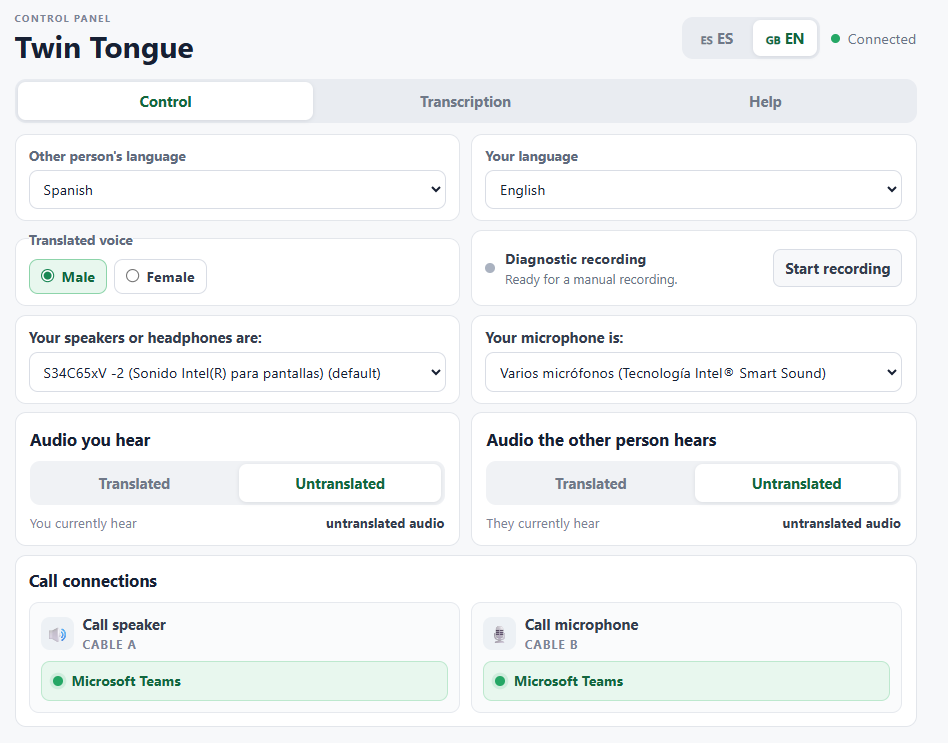
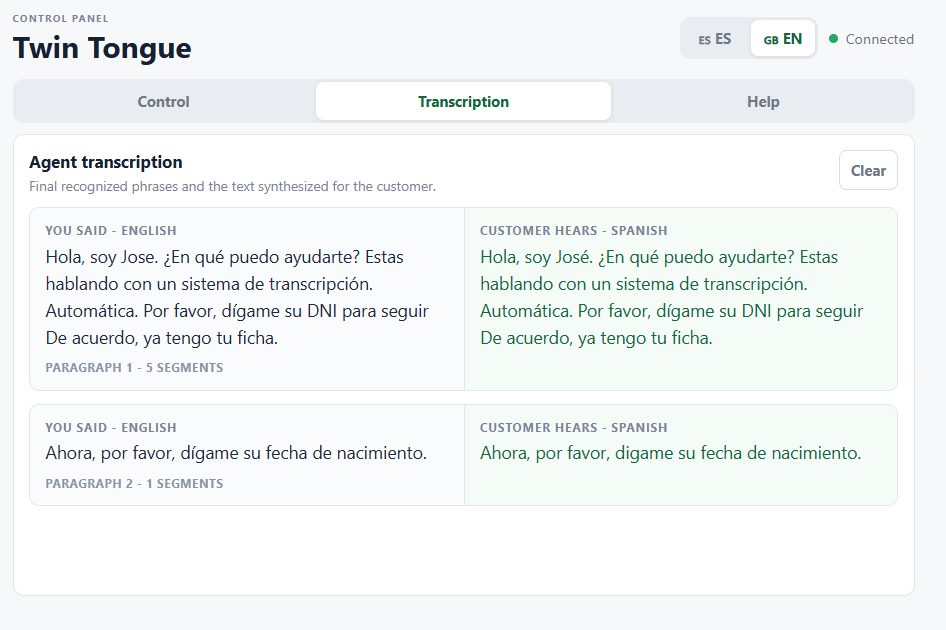

# Twin Tongue

Twin Tongue is a Windows application for bidirectional, real-time speech translation during calls. It connects physical audio devices and two VB-CABLE routes to provide two independent flows:

- `remote_to_agent`: captures the remote participant, transcribes and translates their speech, and plays the result through the agent's headphones.
- `agent_to_remote`: captures the agent's microphone, transcribes and translates their speech, and sends the synthesized result to the calling application.

Each direction can run in translated mode or as direct PCM passthrough. The local control panel exposes pipeline state, participant languages, voice selection, audio devices, final transcripts, call connections, and operational status.

## Problem and motivation

Language barriers make everyday conversations slower and less effective. In customer service and technical support, they can lead to transfers, repeated explanations, longer resolution times, or prevent the right specialist from helping at all. Most real-time translation tools focus on helping one person understand translated audio; a productive conversation also requires that person to answer and be understood.

This project comes directly from situations I see in my day-to-day work. My goal is to explore a practical tool for companies and individuals who want to communicate more effectively without requiring both participants to speak the same language or change their usual calling application.

Twin Tongue is submitted in the **Productivity and Business** category because its main purpose is to reduce communication friction: helping support teams, specialists, colleagues, and individuals hold a two-way conversation using the language in which each person communicates best.

## How it works

```text
Remote application -> CABLE-A Input -> CABLE-A Output -> Twin Tongue
Twin Tongue -> STT -> translation -> TTS -> agent headphones

Agent microphone -> Twin Tongue -> STT -> translation -> TTS
Twin Tongue -> CABLE-B Input -> CABLE-B Output -> calling application
```

The `remote_to_agent` pipeline listens to the audio that the calling application sends into `CABLE-A Input`. Twin Tongue captures it from `CABLE-A Output`, detects speech, sends speech segments to STT, translates final transcripts, synthesizes translated speech, and plays the result through the agent's selected output device.

The `agent_to_remote` pipeline captures the agent microphone, processes it through the same STT, translation, and TTS stages, and writes the translated audio to `CABLE-B Input`. The calling application uses `CABLE-B Output` as its microphone source.

Audio is captured as 48 kHz `int16` PCM in 20 ms blocks. Input is converted to mono and resampled once to 16 kHz for Silero VAD and ElevenLabs Realtime STT. Audio sent to STT is grouped into configurable provider chunks, 100 ms by default. Translated text is synthesized with ElevenLabs streaming TTS, resampled for the selected output, and played incrementally.

Bounded queues, stale-segment protection, asynchronous logging, periodic metrics, and independent provider sessions keep the two real-time paths responsive and isolated.

## Core capabilities

- Independent bidirectional pipelines with isolated provider sessions and queues.
- Runtime switching between `passthrough` and `translate` mode per direction.
- English, Spanish, French, and Catalan language selection.
- Male and female translated voice selection through configured ElevenLabs voices.
- Silero VAD using bundled ONNX models.
- Configurable minimum speech and silence durations to reject short false activations.
- ElevenLabs Realtime STT with timestamped words and diagnostic `logprob` traces.
- Configurable STT provider chunk duration, set to 100 ms by default.
- Google Cloud Translation Basic v2.
- ElevenLabs streaming TTS.
- Automatic Windows communications-device discovery and selectable physical devices.
- Fixed CABLE A and CABLE B routing with active call-session visibility.
- A loopback-only local web control panel at `http://127.0.0.1:8765`.
- Final transcript visibility and diagnostic recording controls.
- Rotating logs, daily CSV metrics, and automated tests.
- Windows distribution packaging through PyInstaller.

## Screenshots

The control panel exposes both translation directions, participant languages, translated voice, physical audio devices, passthrough or translation mode, recording controls, and applications connected to the virtual call routes.



The transcription view groups recognized and translated phrases so the agent can review what Twin Tongue understood and what the customer hears.



## Current status

Twin Tongue is a working Windows desktop/runtime prototype with real audio routing, provider integrations, a local control panel, diagnostic tools, packaging support, automated tests, and successful end-to-end functional calls. It is not yet a polished consumer application or hosted service.

Current development priorities include:

- simpler first-run setup for non-technical users;
- stronger audio-device and virtual-route validation;
- continued tuning of STT segmentation and false-positive rejection;
- lower end-to-end conversational latency;
- acoustic echo cancellation that preserves safe barge-in and full-duplex conversation;
- noise reduction before VAD and STT;
- broader reliability validation with real meeting and contact-center software;
- packaging and usability improvements for internal pilots.

The [technical roadmap](docs/roadmap.md) describes how these improvements build on the validated prototype toward a consistently reliable production experience.

## Requirements

- Windows with native Windows Python 3.12 or later.
- VB-CABLE A+B for integration with calling applications.
- ElevenLabs credentials for STT and TTS.
- Google Cloud Translation Basic v2 credentials.
- Headphones, strongly recommended during audio tests.

Do not run hardware audio diagnostics from WSL. PortAudio must access native Windows audio devices.

## Installation

From PowerShell:

```powershell
py -m venv .venv
.\.venv\Scripts\Activate.ps1
python -m pip install --upgrade pip
python -m pip install -e .
```

If script execution is disabled in the current shell, use the virtual-environment interpreter directly:

```powershell
.\.venv\Scripts\python.exe .\src\main.py
```

## Credentials and configuration

Copy the environment template and provide your credentials:

```powershell
Copy-Item .env.example .env
```

Twin Tongue reads these values from `.env`:

- `ELEVENLABS_API_KEY` for speech-to-text and text-to-speech.
- `GOOGLE_TRANSLATE_API_KEY` for Google Cloud Translation Basic v2.
- `GOOGLE_TRANSLATE_PROJECT_ID` as local project metadata only. It is not sent by the translation client.

Never commit or share `.env`. API keys are not written to application logs.

Runtime defaults live in `config/default.toml`. This file defines audio formats, providers, pipeline devices, voice detection, segmentation, latency protection, TTS voices, diagnostic recording, logging, metrics, and the local server.

The application stores the selected physical input and output devices, interface language, participant languages, and voice gender in `config/audio-device-preferences.json`. Device preferences use stable endpoint IDs and fall back to the Windows communications defaults while a saved device is unavailable.

## Running the application

Activate the environment and start both directions:

```powershell
.\.venv\Scripts\Activate.ps1
python .\src\main.py
```

Run only one direction or stop automatically after a fixed duration:

```powershell
python .\src\main.py --pipeline remote_to_agent
python .\src\main.py --pipeline agent_to_remote --duration 60
```

The default duration is `0`, which runs until `Ctrl+C`. The web interface is enabled by configuration and accepts loopback addresses only. It can be disabled or moved to another local port:

```powershell
python .\src\main.py --no-web
python .\src\main.py --web-port 9000
```

Open the control panel at `http://127.0.0.1:8765` when the web server is enabled. Both directions start in passthrough mode by default so audio routing can be validated before translation providers are used. Translation can then be enabled independently for each direction.

## VB-CABLE setup

Install and validate the two virtual routes before running the complete application. Follow [VB-CABLE setup and validation](docs/vb-cable-setup.md) for installation, no-code routing tests, cleanup, and troubleshooting.

The normal endpoints are:

- Remote to agent: the calling application outputs to `CABLE-A Input`; Twin Tongue captures `CABLE-A Output`.
- Agent to remote: Twin Tongue outputs to `CABLE-B Input`; the calling application captures `CABLE-B Output`.

Do not select the 16-channel variants.

## Diagnostic tools

The `tools/` directory contains focused diagnostics for device discovery, callback stability, capture/playback, continuous monitoring, STT, translation, and TTS. Use the narrowest tool that can isolate the failing layer before running the full pipeline.

See [Diagnostic and support tools](docs/tools.md) for commands, options, expected output, and safety notes.

## Tests

The project uses the standard library's `unittest` runner:

```powershell
.\.venv\Scripts\python.exe -m unittest discover -s tests -v
```

Tests cover application state, audio buffering and pacing, device discovery, provider behavior, resampling, VAD, speech segmentation, pipeline latency policy, logging, metrics, and the local UI server. Hardware diagnostics remain explicit manual tests because their result depends on the host devices and drivers.

## Logs, metrics, and diagnostic audio

Runtime logs are written asynchronously to `logs/twin-tongue.log`. Rotation size, retained file count, queue capacity, and level are configured in `[logging]`.

Metrics are written to daily `logs/metrics-YYYY-MM-DD.csv` files. They include queue pressure, discarded blocks and segments, callback gaps, output underflows, event-loop lag, recording drops, provider activity, playback latency, VAD, and segmentation counters.

Timestamped ElevenLabs transcripts expose word-level `logprob` values. Debug traces record word count, average and minimum log probability, timing, and word data to support analysis of STT false positives.

When `[stt.audio_capture].enabled` is `true`, diagnostic audio is recorded automatically for each direction using translation. The control panel also provides manual recording controls. Generated audio, logs, and metrics are excluded from source control and distribution packages.

## Building a Windows distribution

Create a portable `win64` directory and ZIP:

```powershell
.\packaging\build_distribution.ps1
```

Use `-SkipDependencyInstall` when the build dependencies are already available. Output is written under `artifacts/distribution/` and includes a SHA-256 checksum. The package excludes `.env`, private keys, logs, metrics, and local preferences.

For controlled internal testing, a reusable self-signed identity can be created and supplied to the build:

```powershell
.\tools\create_signing_certificate.ps1
.\packaging\build_distribution.ps1 `
  -SigningCertificateThumbprint CERTIFICATE_THUMBPRINT
```

A self-signed certificate is not appropriate for public distribution and does not replace organizational security approval. See [Distribution guide](docs/distribution.md) for package contents, certificate handling, and recipient instructions.

## Project structure

```text
config/      Runtime defaults and local preference location
docs/        Project, operations, and support documentation
packaging/   Build scripts, certificates, and bundled driver assets
src/         Application, audio, providers, pipelines, and local UI
tests/       Unit and synthetic integration tests
tools/       Focused diagnostics and support utilities
```

## Collaboration with Codex and GPT-5.6

Codex was used as an engineering collaborator throughout the project, with GPT-5.6 providing reasoning and implementation support behind repository exploration, code changes, validation, and documentation. This accelerated repetitive and cross-cutting work such as tracing audio flows across modules, keeping configuration and tests aligned, implementing bounded real-time components, and running broad regression checks.

The project owner remained responsible for the product, engineering, and design decisions. These include treating translation as a two-way conversation, focusing on real communication problems observed through day-to-day work, choosing customer support and business communication as primary contexts, using explicit CABLE A and CABLE B routes, supporting passthrough alongside translation, and defining the latency, privacy, and reliability trade-offs.

Codex contributed most strongly where fast iteration and repository-wide consistency mattered: proposing implementation approaches, identifying edge cases, updating tests with production code, checking packaging metadata, and verifying changes with the automated suite. The result is a human-led product and technical implementation accelerated by Codex-assisted engineering.

## Third-party components

Twin Tongue bundles only the Silero VAD ONNX models it uses. Their license is stored beside the models and copied into distribution packages. All provider services remain subject to their respective terms, privacy requirements, and usage charges.
