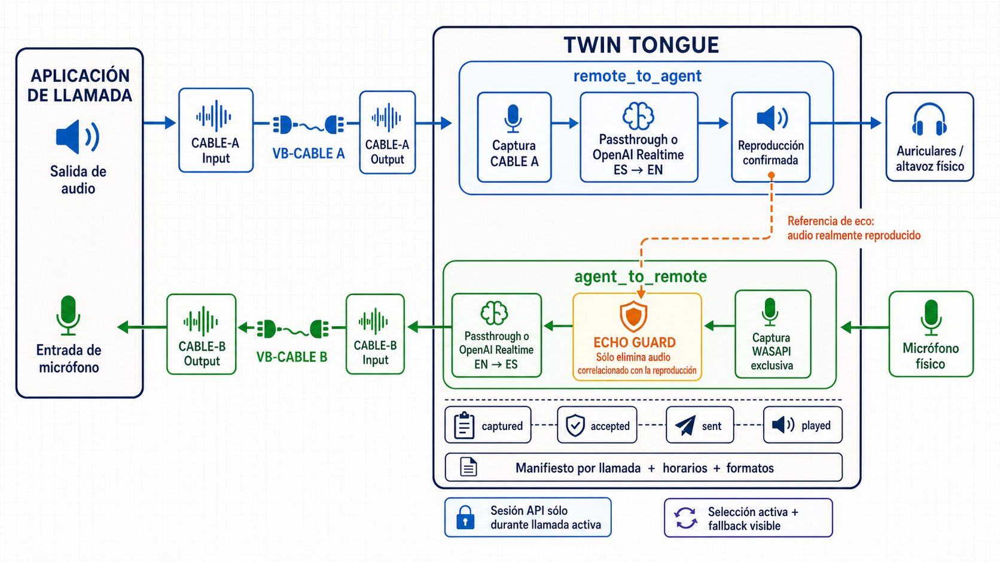

# Audio device and routing architecture

This document explains how a calling application, VB-CABLE A+B, the physical
audio devices, and Twin Tongue connect to each other. The endpoint names are
initially confusing: for a virtual cable, `Input` is the playback side where an
application writes audio, while `Output` is the recording side where another
application captures that same audio.



## How CABLE B connects the calling application to Twin Tongue

The calling application does not capture the physical microphone directly
during normal Twin Tongue operation. The complete outgoing route is:

```text
Physical microphone
  -> Twin Tongue captures the microphone
  -> WebRTC AEC3
  -> passthrough or translation
  -> Twin Tongue plays PCM to CABLE-B Input
  -> the VB-CABLE B driver transports it internally
  -> the calling application captures the same PCM from CABLE-B Output
  -> remote participant
```

`CABLE-B Input` and `CABLE-B Output` are the two sides of one virtual device;
they are not two independent sources. Twin Tongue opens `CABLE-B Input` as an
audio output. The calling application opens `CABLE-B Output` as its microphone.
That is the connection between them.

## Required endpoints

| Consumer | Setting | Endpoint |
|---|---|---|
| Calling application | Speaker/output | `CABLE-A Input` |
| Calling application | Microphone/input | `CABLE-B Output` |
| Twin Tongue | Remote audio capture | `CABLE-A Output` |
| Twin Tongue | Physical microphone capture | Selected physical input |
| Twin Tongue | Agent listening output | Selected physical headphones/speaker |
| Twin Tongue | Audio sent to the calling application | `CABLE-B Input` |

Use the normal stereo CABLE endpoints. Do not select the 16-channel or
`VB-Audio Point` variants.

## Incoming direction: `remote_to_agent`

1. The calling application renders the remote participant through its selected
   speaker/output, `CABLE-A Input`.
2. VB-CABLE A exposes that PCM on its recording side, `CABLE-A Output`.
3. Twin Tongue captures `CABLE-A Output`.
4. In passthrough, Twin Tongue forwards the original audio. In translation
   mode, the direction sends mono 24 kHz PCM to its own OpenAI Realtime session
   and receives translated audio.
5. Twin Tongue plays the selected result through the physical headphones or
   speaker.
6. The PortAudio playback callback confirms the PCM that was actually delivered
   to the physical output. That confirmed signal becomes the far-end reference
   used by WebRTC AEC3 in the opposite direction.

Using callback-confirmed playback is important: AEC3 receives the signal that
could really have reached the microphone acoustically, rather than the original
CABLE A stream or translated audio that was generated but never played.

## Outgoing direction: `agent_to_remote`

1. Twin Tongue captures the selected physical microphone through the Windows
   shared graph so its Realtek gain and processing match the native Windows
   microphone test. Exclusive mode remains configurable for controlled tests.
   CABLE endpoints stay shared because the calling application and Twin Tongue
   must use the two sides simultaneously.
2. The raw endpoint PCM is written to the diagnostic `captured` track.
3. The PCM is converted to mono and, when enabled, processed by WebRTC AEC3.
4. The resulting canonical mono PCM is written to `accepted`.
5. In passthrough, this accepted PCM is written directly to `CABLE-B Input`.
   In translation mode, it is resampled and sent to the independent
   `agent_to_remote` OpenAI Realtime session.
6. The original or translated PCM is played into `CABLE-B Input`.
7. VB-CABLE B exposes it on `CABLE-B Output`, which the calling application is
   already capturing as its microphone/input.
8. The calling application sends that audio to the remote participant.

The two translation directions use separate sessions. Activating one does not
automatically activate the other. Their transport, runtime state, and ordinary
failures remain isolated, while OpenAI quota and rate-limit cooldowns are shared
because both sessions use the same project and model capacity.

## Exact WebRTC AEC3 position

WebRTC AEC3 runs only in `agent_to_remote`, after physical microphone capture
and channel conversion, and before either passthrough or API transmission:

```text
physical capture -> captured -> mono -> WebRTC AEC3 capture input -> accepted
                                                         |-> passthrough -> CABLE-B Input
                                                         `-> resample -> sent -> OpenAI
                                                                              |
                                       output <- played <- resample <- received
```

The AEC3 reverse stream is populated only by audio confirmed as rendered by
the physical-output callback in `remote_to_agent`. Silence is also reported so
the render timeline remains continuous:

```text
remote_to_agent physical playback callback
  -> channel conversion / render-rate adaptation
  -> 10 ms WebRTC AEC3 reverse-stream frames
  -> adaptive echo estimate
                           physical microphone
                             -> mono
                             -> 10 ms WebRTC AEC3 capture frames
                             -> echo-cancelled accepted audio
```

The adapter around WebRTC:

- converts both paths to the mono PCM format expected by this integration;
- splits the application's 20 ms audio blocks into WebRTC's 10 ms frames;
- resamples the render reference if its physical output rate differs from the
  microphone rate;
- supplies the configured external stream delay;
- resets adaptive state at call start and end so one call cannot contaminate
  the next;
- bypasses cancellation without altering the capture block if the native
  processor reports an error.

Echo estimation and cancellation are performed by WebRTC Audio Processing's
native AEC3 implementation. Twin Tongue does not implement its own correlation
threshold or suppression algorithm. The integration follows WebRTC's
[AEC3 render/capture contract](https://webrtc.googlesource.com/src/+/refs/heads/main/modules/audio_processing/aec3/echo_canceller3.h)
through the
[`aec-audio-processing`](https://pypi.org/project/aec-audio-processing/)
native binding.

The Realtime insertion point is implemented in
[`src/pipelines/openai_realtime.py`](../src/pipelines/openai_realtime.py), and
the WebRTC framing and integration adapter is implemented in
[`src/audio/webrtc_aec3.py`](../src/audio/webrtc_aec3.py). The Classic pipeline
uses the same shared AEC3 instance and logical position.

## Call-aware session gate

Twin Tongue monitors the Windows application sessions attached to the cable
endpoints:

- `remote_to_agent` watches the calling application rendering to
  `CABLE-A Input`;
- `agent_to_remote` watches the calling application capturing from
  `CABLE-B Output`.

Enabling translation arms the direction without opening an API session. The
session opens when the corresponding application session becomes active and
receives continuous audio, including silence, for that stabilized call. The
configured disconnect grace keeps the call state stable for AEC3 and diagnostics
during short Windows monitoring gaps. When the grace expires, Twin Tongue
flushes the input and closes the provider session gracefully before a future
call receives a new session. Passthrough remains local and does not require an
API session.

## Diagnostic audio stages

Each direction separates the evidence into five tracks:

| Track | Exact meaning |
|---|---|
| `captured` | Raw PCM received from the input endpoint. For `agent_to_remote`, this is the physical microphone; for `remote_to_agent`, this is CABLE A. |
| `accepted` | Canonical mono PCM after WebRTC AEC3 for `agent_to_remote`; canonical mono input for `remote_to_agent`. |
| `sent` | PCM successfully written to the translation provider. It is normally empty in passthrough. |
| `received` | Translated 24 kHz PCM received from the provider before local resampling and output buffering. |
| `played` | PCM confirmed by the output callback: physical playback for `remote_to_agent`, or PCM written to CABLE B for `agent_to_remote`. |

Diagnostic capture also includes:

- CABLE A recording even while the direction is in passthrough;
- JSONL timing marks for each track;
- a per-call JSON manifest with devices, formats, opening/closing times,
  gate events, track paths, queue counters, AEC3 statistics, and per-intervention
  `accepted → sent → received → played` voice-onset latency;
- periodic WAV-header refresh and startup repair for files left incomplete by
  an abnormal shutdown.

These stages make it possible to determine whether a signal was lost at the
physical endpoint, changed by AEC3, not sent to the provider, or not
delivered to the output device.

## Device resilience and latency protection

The integrated audio protections are:

- stable Windows endpoint identity instead of relying only on volatile
  PortAudio indexes;
- health probing and first-callback validation;
- quarantine of an unresponsive physical device;
- automatic replacement by a working endpoint, persisted as the new
  selection and shown in the web interface;
- configurable WASAPI shared/exclusive physical capture, using shared mode by
  default to retain the validated Realtek gain and audio processing;
- bounded asynchronous capture, network-send, and playback queues;
- dropping of stale/backlogged audio rather than emitting an old translation
  late;
- separate session and status handling for each direction, with coordinated
  rate-limit cooldowns across both directions.

## Windows settings that must remain disabled

During normal Twin Tongue operation:

- disable **Listen to this device** on every microphone and virtual cable;
- keep **Stereo Mix** disabled;
- do not make a physical microphone listen through CABLE B;
- do not make CABLE A listen through the physical output;
- use headphones when testing to reduce real acoustic coupling.

Windows **Listen** bridges are useful only for the isolated no-code cable tests
described in [VB-CABLE setup and validation](vb-cable-setup.md). Disable them
before starting Twin Tongue.

For layer-by-layer acceptance tests, follow the
[isolated audio pipeline test runbook](isolated-pipeline-tests.md).
