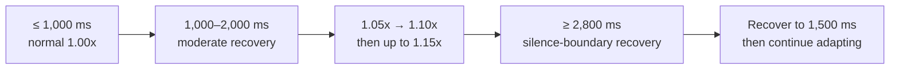

# CSV metrics reference

This document is the primary reference for support staff investigating the
OpenAI Realtime pipeline. The CSV answers _what the audio pipeline was doing_;
`logs/twin-tongue.log` answers _which lifecycle event or failure occurred_.

## Files and row cadence

`[observability.metrics]` controls the writer:

- `enabled = true` enables CSV output.
- `file = "logs/metrics.csv"` produces one daily file named
  `logs/metrics-YYYY-MM-DD.csv`.
- `retention_days = 14` keeps the current day and the previous 13 calendar days.
- `interval_seconds = 60.0` is the Classic pipeline snapshot interval.

Realtime has its own, shorter diagnostic cadence:
`pipeline.speech_to_speech.defaults.translation.openai_realtime.metrics_interval_seconds`
is 10 seconds by default. Both directions append to the same daily file and are
distinguished by `pipeline`.

An empty cell means that the metric does not apply to that engine or that no
measurement was available yet. Most counters and maxima are cumulative for the
current pipeline process or audio stream. Realtime connection latency and audio
levels reset on a new WebSocket connection, while byte, transcript, error,
connection and reconnection counters remain cumulative on the pipeline's
provider object. Backlog percentiles use a bounded rolling sample window.
`event_loop_maximum_lag_ms` and the Classic VAD peak are interval measurements.

When comparing two rows, group by `pipeline` and order by `timestamp`. For a
cumulative counter, subtract the earlier value from the later value to find the
events in that period. A counter remaining non-zero is historical; a counter
increasing is an active problem.

## How the Realtime queues work

Every block outside the provider framing boundary represents 20 ms of audio
with the shipped configuration.

```mermaid
flowchart LR
    A["Audio capture callback<br/>20 ms blocks"] --> B["Input queue<br/>25 blocks = 500 ms"]
    B --> C["Channel conversion + resampler<br/>PCM16 mono, 24 kHz"]
    C --> D["Provider framing<br/>200 ms per frame"]
    D --> E["Send queue<br/>3 frames = 600 ms"]
    E --> F["OpenAI Realtime<br/>WebSocket"]
    F --> G["Receive queue<br/>150 blocks = 3,000 ms"]
    G --> H["Adaptive playout<br/>1.00x to 1.15x"]
    H --> I["Playback queue<br/>12 blocks = 240 ms"]
    I --> J["Output callback<br/>headphones or CABLE B"]
```

The queues have different jobs:

- The input queue isolates the PortAudio capture callback from asynchronous
  processing. If it fills, the oldest capture block is discarded to remain live.
- The send queue absorbs short WebSocket stalls. Its units are 200 ms provider
  frames, despite the historical `*_blocks` metric suffix.
- The receive queue absorbs bursty provider delivery. It is intentionally larger
  than the playback queue so adaptive playout can reduce a growing backlog.
- The playback queue feeds the hardware callback. Empty-buffer events produce
  silence; a full queue drops the oldest block and marks a discontinuity.

Adaptive playout uses four backlog levels:

The speed change is pitch-preserving. If the emergency threshold is reached,
Twin Tongue searches for a quiet boundary, removes only enough stale audio to
return near the recovery level, and crossfades the discontinuity. The associated
drop and discontinuity counters make this intervention visible.

## Fast interpretation

| Symptom | Metrics to compare | Likely interpretation |
| --- | --- | --- |
| Choppy translated audio | `realtime_playback_empty_buffer_events`, `translated_output_underflows`, `realtime_playback_maximum_callback_gap_ms` | The output callback ran without translated audio, the driver reported an underflow, or callbacks stalled. |
| Translation becomes increasingly late | `realtime_backlog_p95_ms`, `realtime_backlog_time_above_target_ms`, `realtime_adaptive_speed` | Provider output is arriving faster or more burstily than real-time playback can consume it. |
| Words or phrases disappear | receive/playback dropped-block metrics and `realtime_received_queue_discontinuities` | A bounded queue overflowed or emergency backlog recovery intentionally skipped stale audio. |
| Translation never starts | gate fields, `realtime_errors`, `realtime_reconnections` | No call application is attached, session detection is unknown, or the provider cannot establish a stable session. |
| Captions move but audio is silent | output RMS/peak, playback empty events, `received` and `played` diagnostic WAVs | The provider returned no audio, local conversion failed, or playback starved. |
| Input is silent or distorted | input RMS/peak, capture invalid/drop/overflow counters | Wrong endpoint, very low gain, clipping, channel/downmix problem, or capture callback instability. |
| Audio worsens during disk recording | `recording_dropped_blocks`, callback gaps, event-loop lag | Diagnostic recording or host I/O is overloaded; audio remains prioritized and recording blocks are discarded. |
| Repeated pauses every reconnect | `realtime_errors`, `realtime_reconnections`, gate activations/deactivations | Transport/provider instability or an unstable call-session signal. |

Treat isolated startup increments cautiously. Diagnose a sustained incident from
changes across at least two consecutive rows and correlate their timestamps with
the support log.

## Identity and shared fields

| Column | Meaning and support use |
| --- | --- |
| `timestamp` | Local timezone ISO-8601 time when the row was written. |
| `pipeline` | `remote_to_agent` or `agent_to_remote`; always filter by this first. |
| `mode` | Effective mode at snapshot time: normally `passthrough` or `translate`. |
| `engine` | `openai_realtime` or `classic`. Blank engine-specific fields are expected. |

## Capture and callback fields

| Column | Meaning and support use |
| --- | --- |
| `capture_blocks` | Blocks delivered by the input callback since the current capture stream started. It should increase steadily during a run. |
| `capture_dropped_blocks` | Oldest input blocks discarded because the bounded capture queue was full. Increasing values mean processing could not keep up. |
| `capture_overflows` | Input-overflow flags reported by PortAudio/the driver. Increasing values point below the application layer. |
| `capture_invalid_blocks` | Callback blocks with an unexpected byte size. Any increase is abnormal. |
| `capture_maximum_buffered_blocks` | Highest capture-queue occupancy observed. Compare with the configured input capacity of 25 blocks for Realtime. |
| `capture_maximum_callback_gap_ms` | Largest time between input callbacks. With 20 ms blocks, sustained values well above 20 ms indicate scheduling or device stalls. |
| `passthrough_output_dropped_blocks` | Blocks discarded from the Classic passthrough output queue. Normally blank for Realtime. |
| `passthrough_output_underflows` | Driver underflows on the Classic passthrough output. |
| `passthrough_output_empty_buffer_events` | Classic output callbacks that found no queued audio and emitted silence. |
| `passthrough_output_invalid_blocks` | Unexpected block sizes at the Classic passthrough output. |
| `passthrough_output_maximum_buffered_blocks` | Peak Classic passthrough queue occupancy. |
| `passthrough_output_maximum_callback_gap_ms` | Largest gap between Classic passthrough output callbacks. |
| `translated_output_underflows` | Driver underflows on translated playback. In Realtime this mirrors the active output stream's underflow count. |
| `recording_dropped_blocks` | Diagnostic WAV blocks discarded to keep disk I/O from blocking audio. A non-zero value affects diagnostics, not necessarily live audio. |
| `event_loop_maximum_lag_ms` | Largest observed asyncio scheduling delay in the interval. Large spikes can starve network and queue tasks. |

## Classic-only processing fields

These columns remain in the common schema for backwards compatibility. They are
normally empty in the deployed Realtime configuration and should not be used to
diagnose it.

| Column | Meaning |
| --- | --- |
| `final_transcripts` | Final STT transcripts accepted by Classic. |
| `translations` | Text translations completed by Classic. |
| `syntheses` | TTS syntheses completed by Classic. |
| `played_segments` | Synthesized segments started/completed for playback. |
| `dropped_transcripts` | Transcript work discarded before translation. |
| `dropped_translations` | Translation work discarded before TTS. |
| `dropped_syntheses` | Synthesized work discarded before playback. |
| `stale_before_translation` | Segments rejected because they were already too old before translation. |
| `stale_before_tts` | Segments rejected because they were too old before TTS. |
| `stale_before_playback` | Segments rejected because they were too old before playback. |
| `superseded_before_playback` | Older synthesized segments replaced by newer work under latency protection. |
| `maximum_playback_start_latency_ms` | Highest Classic segment-to-playback start delay. |
| `vad_peak_probability` | Highest Silero speech probability in the latest metrics interval. |
| `vad_activations` | Cumulative Silero speech-start detections. |
| `vad_endings` | Cumulative Silero speech-end detections. |
| `vad_max_inference_ms` | Highest Silero inference duration. |
| `segmentation_silence_boundaries` | Segments closed on normal silence. |
| `segmentation_punctuation_boundaries` | Segments closed using stable punctuation. |
| `segmentation_short_pause_boundaries` | Segments closed on an accepted short pause. |
| `segmentation_maximum_duration_boundaries` | Segments forced closed at the maximum duration. |

## Realtime latency, duration, and signal fields

| Column | Meaning and support use |
| --- | --- |
| `realtime_first_audio_latency_ms` | Current connection latency from its first submitted input audio to its first returned output audio. It is not the full person-to-speaker latency. |
| `realtime_total_latency_ms` | At the latest output delta, elapsed time since the most recent input append. It is a trailing provider timing signal, despite the historical `total` name. Use voice latency for the end-to-end local path. |
| `realtime_input_audio_duration_ms` | Cumulative duration successfully sent by the provider object during the pipeline run, including reconnects. |
| `realtime_output_audio_duration_ms` | Cumulative translated-audio duration received by the provider object during the pipeline run, including reconnects. |
| `realtime_input_rms_dbfs` | Sampled input RMS in dBFS. Very negative values indicate silence/low level; values near 0 dBFS risk clipping. Compare with the WAV, not a universal threshold. |
| `realtime_input_peak_amplitude` | Largest absolute sampled PCM16 input value (full scale is 32767). |
| `realtime_output_rms_dbfs` | Sampled provider-output RMS in dBFS. Empty/very low values with growing input duration indicate no translated audio. |
| `realtime_output_peak_amplitude` | Largest absolute sampled PCM16 provider-output value. |
| `realtime_input_transcript_characters` | Cumulative source-caption characters received during the pipeline run. |
| `realtime_output_transcript_characters` | Cumulative translated-caption characters received during the pipeline run. |
| `realtime_voice_latency_completed_utterances` | Utterances for which accepted input speech was matched to callback-confirmed output speech. |
| `realtime_voice_latency_pending_utterances` | Detected input utterances still waiting for played translated speech. Persistent growth means translation/playback is not completing. |
| `realtime_voice_latency_last_ms` | Latest accepted-input speech start to translated speech actually played. This is the most useful end-to-end conversational latency value. |
| `realtime_voice_latency_average_ms` | Average accepted-to-played speech latency for completed utterances. |

## Realtime send and receive queue fields

| Column | Meaning and support use |
| --- | --- |
| `realtime_send_queue_buffered_blocks` | Current queued provider frames waiting for the WebSocket. Each item is 200 ms by default. |
| `realtime_send_queue_dropped_blocks` | Provider frames discarded because the send queue was full or cleared. Increasing values mean network sending fell behind or a lifecycle transition flushed work. |
| `realtime_received_queue_buffered_blocks` | Current 20 ms provider-output blocks waiting for adaptive playout. |
| `realtime_received_queue_buffered_ms` | Current receive backlog expressed in milliseconds. |
| `realtime_received_queue_maximum_buffered_blocks` | Highest receive-queue occupancy in the current pipeline run. |
| `realtime_received_queue_maximum_buffered_ms` | The same maximum expressed in milliseconds. |
| `realtime_received_queue_dropped_blocks` | Provider-output blocks removed or rejected from the receive queue. |
| `realtime_received_queue_dropped_ms` | Receive drops converted to audio duration. |
| `realtime_received_queue_discontinuities` | Intentional timeline jumps caused by receive-queue recovery. Correlate with audible missing content. |
| `realtime_received_queue_silence_boundary_dropped_blocks` | Subset of receive drops made at the quietest available boundary during emergency recovery. |

## Realtime adaptive playout fields

| Column | Meaning and support use |
| --- | --- |
| `realtime_backlog_p50_ms` | Median sampled total translated-audio backlog. |
| `realtime_backlog_p95_ms` | 95th-percentile backlog; the best single indicator of persistent queue pressure. |
| `realtime_backlog_p99_ms` | Near-worst sampled backlog, less sensitive than a single maximum. |
| `realtime_backlog_time_above_target_ms` | Cumulative time with backlog above `target_backlog_ms`. |
| `realtime_adaptive_speed` | Current playback speed ratio: `1.0` is normal; above target it ramps from 1.05 toward the configured moderate and maximum speeds. |
| `realtime_adaptive_maximum_speed` | Highest speed ratio used in the current pipeline run. |
| `realtime_time_compression_ratio` | Input samples divided by output samples for compressed audio. Values above 1 show how much duration was recovered. |

## Realtime playback queue fields

| Column | Meaning and support use |
| --- | --- |
| `realtime_playback_buffered_blocks` | Current 20 ms blocks awaiting the hardware output callback. |
| `realtime_playback_buffered_ms` | Current hardware playback backlog in milliseconds. |
| `realtime_playback_maximum_buffered_blocks` | Highest playback-queue occupancy. Compare with its configured capacity of 12. |
| `realtime_playback_maximum_buffered_ms` | The same maximum expressed in milliseconds. |
| `realtime_playback_dropped_blocks` | All blocks discarded by the shared Realtime output queue. |
| `realtime_translated_playback_dropped_blocks` | Drops attributed to translated audio. |
| `realtime_passthrough_playback_dropped_blocks` | Drops attributed to original-audio passthrough. These can occur during mode/session transitions. |
| `realtime_playback_empty_buffer_events` | Output callbacks that had no block and emitted silence. Increases during active translated speech correlate strongly with choppiness. |
| `realtime_playback_invalid_blocks` | Output blocks with an unexpected byte size. Any increase is abnormal. |
| `realtime_playback_maximum_callback_gap_ms` | Largest time between output callbacks. With 20 ms blocks, large increases indicate host scheduling or driver stalls. |

`realtime_playback_dropped_blocks` is the output object's total. The translated
and passthrough fields identify the source whose `push_block` call observed a
drop; do not add all three as independent losses.

## Realtime session-gate and reliability fields

| Column | Meaning and support use |
| --- | --- |
| `realtime_session_gate_enabled` | Whether call-aware provider-session gating is configured. |
| `realtime_session_gate_audio_allowed` | Whether the current stabilized decision permits audio to be sent to OpenAI. |
| `realtime_session_gate_observation` | Raw application-session observation: `active`, `inactive`, or `unknown`. |
| `realtime_session_gate_call_active` | Stabilized call state after grace/failure handling. |
| `realtime_session_gate_activations` | Number of stabilized inactive-to-active transitions. |
| `realtime_session_gate_deactivations` | Number of stabilized active-to-inactive transitions. |
| `realtime_session_gate_blocked_ms` | Cumulative time the gate has prevented provider audio/session use. This is normal while no call is attached. |
| `realtime_errors` | Provider/session errors counted during the pipeline run. Correlate increases with `ERROR`/`WARNING` log events. |
| `realtime_reconnections` | Reconnects counted during the pipeline run. Repeated increases indicate instability, quota pressure, or rate limiting. |

## Suggested incident evidence

For a Realtime audio incident, preserve:

1. The daily metrics CSV covering at least one minute before and after the issue.
2. `logs/twin-tongue.log` and its rotated predecessor if the incident crossed a
   rollover.
3. The matching `logs/realtime-audio` call manifest.
4. The five diagnostic tracks only when policy permits recording call audio.
5. Direction, approximate local time, calling application, selected microphone
   and selected output device.

Do not send `.env`. Treat CSVs, logs, manifests, transcripts, and WAV files as
potentially sensitive operational data.
